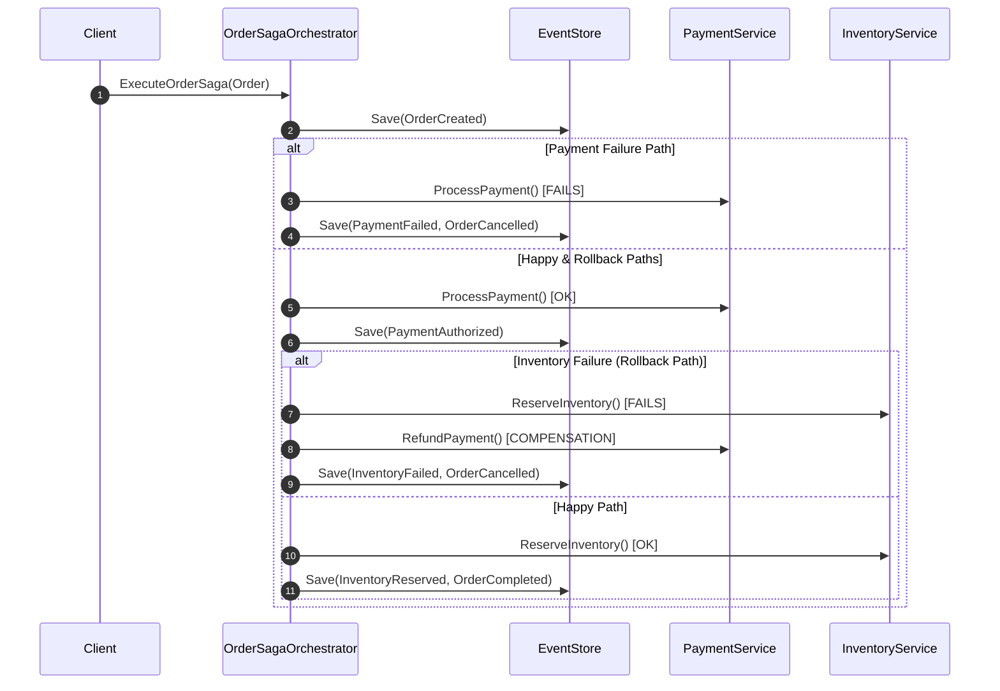

# Order Saga & Event Sourcing in Go

A lightweight implementation of an e-commerce order processing system using **Event Sourcing** and an **Orchestrator-based Saga** pattern with compensating transactions. I built it with zero external dependencies in Go.

---

## 💡 Architecture & Design Decisions

- **Event Sourcing Core:** Orders are not updated in-place. State is reconstructed by applying a sequence of immutable domain events through `LoadFromHistory`, including `OrderCreated`, `PaymentAuthorized`, `InventoryReserved`, and cancellation events.
- **Optimistic Concurrency Control (OCC):** The `EventStore` contract enforces version checks with `expectedVersion != currentVersion`, preventing conflicting concurrent writes.
- **Saga Orchestrator:** `OrderSagaOrchestrator` coordinates the order workflow across payment and inventory services.
- **Compensating Transactions:** If inventory reservation fails after payment authorization, the orchestrator calls `RefundPayment` and marks the order as `CANCELLED`.
- **Simple Infrastructure:** The repository includes a thread-safe in-memory event store using `sync.RWMutex`, which keeps the domain easy to test without adding a database.

---

## 🔄 Saga Execution Flow



---

## Project Layout

```text
internal/domain
  events.go       Domain events and event type constants
  order.go        Event-sourced Order aggregate
  repository.go   EventStore interface and event envelope metadata
  saga.go         Order saga orchestrator and service interfaces
  *_test.go       Event sourcing and saga tests

internal/infrastructure
  memory_event_store.go   Thread-safe in-memory EventStore
```

---

## What the Tests Cover

- Creating an order and recording uncommitted events.
- Applying payment and inventory events to mutate aggregate state.
- Saving and loading event streams through the in-memory event store.
- Hydrating a fresh `Order` from history.
- Successful saga execution.
- Payment failure without calling inventory.
- Inventory failure with payment refund compensation.

---

## Running the Project

```bash
go test ./...
```

The project uses only the Go standard library, so there are no dependency setup steps.

---

## Key Files

- `internal/domain/order.go` contains the aggregate and event application logic.
- `internal/domain/saga.go` contains the orchestrator and compensation flow.
- `internal/infrastructure/memory_event_store.go` contains the OCC-aware in-memory store.
- `internal/domain/saga_test.go` shows the main workflow scenarios with simple mocks.
