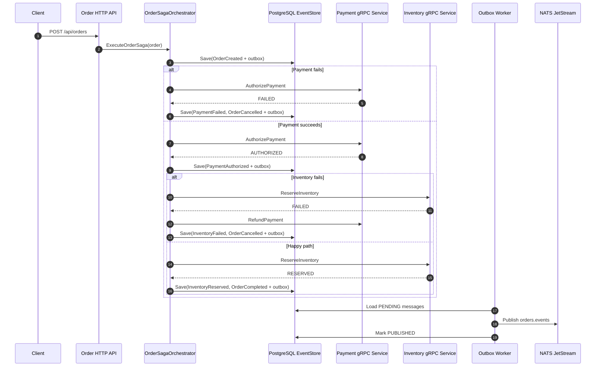

# Order Saga & Event Sourcing in Go

Backend system for order processing built around **Event Sourcing**, an **orchestrator-based Saga**, idempotent HTTP requests, gRPC service calls, PostgreSQL transactions, and the transactional outbox pattern.

I built this project to show how I think about backend systems where state changes matter: orders, payments, inventory, retries, compensation, concurrent writes, and event publication after commit.

---

## Why I Built It

I wanted a compact but production-like Go project that goes beyond basic CRUD.

The main goal was to model a workflow where an order moves through several services and every important state transition is stored as an immutable event. If something fails halfway through, the system records the failure and runs a compensating action instead of hiding the error behind a simple status update.

---

## Architecture

```text
Client
  |
  | HTTP
  v
Order Service
  |-- Idempotency Middleware
  |-- Order Aggregate
  |-- Saga Orchestrator
  |-- PostgreSQL EventStore
  |-- Outbox Worker
  |
  | gRPC
  |----> Payment Service
  |
  | gRPC
  |----> Inventory Service
  |
  | publish
  v
NATS JetStream

PostgreSQL
  |-- events
  |-- outbox
  |-- idempotency_keys
```

### Design Decisions

- **Event Sourcing:** The order state is rebuilt by applying events through `LoadFromHistory`. The current status is a result of history, not a mutable row.
- **Saga Orchestrator:** `OrderSagaOrchestrator` coordinates payment and inventory calls and records each step as a domain event.
- **Compensating Transactions:** If inventory reservation fails after payment authorization, the saga calls `RefundPayment` and cancels the order.
- **Optimistic Concurrency Control:** `SaveEvents` checks `expectedVersion` against the current aggregate version and also relies on a unique DB index on `(aggregate_id, version)`.
- **Transactional Outbox:** Domain events and outbox records are saved in the same PostgreSQL transaction. The worker publishes pending messages to NATS JetStream after commit.
- **Idempotency:** API requests can use `X-Idempotency-Key`; repeated requests receive the stored response body and status code.

---

## Saga Flow


```mermaid
sequenceDiagram
    autonumber
    participant Client
    participant API as Order HTTP API
    participant Saga as OrderSagaOrchestrator
    participant Store as PostgreSQL EventStore
    participant Pay as Payment gRPC Service
    participant Inv as Inventory gRPC Service
    participant Outbox as Outbox Worker
    participant NATS as NATS JetStream

    Client->>API: POST /api/orders
    API->>Saga: ExecuteOrderSaga(order)
    Saga->>Store: Save(OrderCreated + outbox)

    alt Payment fails
        Saga->>Pay: AuthorizePayment
        Pay-->>Saga: FAILED
        Saga->>Store: Save(PaymentFailed, OrderCancelled + outbox)
    else Payment succeeds
        Saga->>Pay: AuthorizePayment
        Pay-->>Saga: AUTHORIZED
        Saga->>Store: Save(PaymentAuthorized + outbox)

        alt Inventory fails
            Saga->>Inv: ReserveInventory
            Inv-->>Saga: FAILED
            Saga->>Pay: RefundPayment
            Saga->>Store: Save(InventoryFailed, OrderCancelled + outbox)
        else Happy path
            Saga->>Inv: ReserveInventory
            Inv-->>Saga: RESERVED
            Saga->>Store: Save(InventoryReserved, OrderCompleted + outbox)
        end
    end

    Outbox->>Store: Load PENDING messages
    Outbox->>NATS: Publish orders.events
    Outbox->>Store: Mark PUBLISHED
```

---

## Tech Stack

- Go
- PostgreSQL
- `database/sql`
- gRPC / Protocol Buffers
- NATS JetStream
- Docker / Docker Compose
- Event Sourcing
- Saga Pattern
- Transactional Outbox
- Idempotency Middleware
- Unit tests

---

## How To Run

Start the full local environment:

```bash
docker compose up --build
```

The `db-migrate` one-shot service applies the idempotent schema before the
Order Service starts. This also handles an existing local PostgreSQL
container where Docker would not rerun `/docker-entrypoint-initdb.d` scripts.

Services:

- Order HTTP API: `http://localhost:8080`
- Liveness check: `http://localhost:8080/healthz`
- Readiness check: `http://localhost:8080/readyz`
- Prometheus metrics: `http://localhost:8080/metrics`
- PostgreSQL: `localhost:5432`
- NATS client port: `localhost:4222`
- NATS monitoring: `http://localhost:8222`
- Payment and Inventory gRPC services are available only inside the Docker network.

---

## API

### Create Order

```bash
curl -X POST http://localhost:8080/api/orders \
  -H "Content-Type: application/json" \
  -H "X-Idempotency-Key: demo-order-1" \
  -d '{
    "customer_id": "customer-1",
    "items": [
      {
        "product_id": "product-1",
        "quantity": 2,
        "price": 100
      }
    ]
  }'
```

Example response:

```json
{
  "order_id": "generated-order-id",
  "status": "COMPLETED"
}
```

### Get Order

```bash
curl http://localhost:8080/api/orders/{order_id}
```

Example response:

```json
{
  "id": "generated-order-id",
  "customer_id": "customer-1",
  "status": "COMPLETED",
  "total_amount": 200,
  "version": 4
}
```

### Health Checks

```bash
curl http://localhost:8080/healthz
curl http://localhost:8080/readyz
curl http://localhost:8080/metrics
```

`/healthz` confirms that the HTTP process is alive. `/readyz` also checks
PostgreSQL and the NATS connection used by the outbox publisher.

## End-to-End Checks

Run the happy path against the running Compose stack:

```bash
sh scripts/e2e.sh
```

Run the same checks with payment and inventory failure injection:

```bash
RUN_FAILURE_SCENARIOS=true sh scripts/e2e.sh
```

The failure scenarios temporarily recreate the gRPC service with
`PAYMENT_FAIL=true` or `INVENTORY_FAIL=true`, then verify the recorded
failure and cancellation events in PostgreSQL.

---

## Project Layout

```text
cmd/
  order-service/       HTTP API, Saga wiring, Outbox worker startup
  payment-service/     standalone gRPC Payment service
  inventory-service/   standalone gRPC Inventory service

internal/
  api/                 HTTP handlers
  clients/             gRPC clients and generated protobuf code
  domain/              events, aggregate, EventStore contract, saga
  infrastructure/      PostgreSQL and in-memory EventStore implementations
  middleware/          idempotency middleware
  outbox/              NATS JetStream publisher worker

proto/                 protobuf contracts
scripts/               PostgreSQL init schema
```

---

## What To Look At

- `internal/domain/order.go` - event-sourced aggregate and event application.
- `internal/domain/saga.go` - saga orchestration and compensation flow.
- `internal/infrastructure/postgres_event_store.go` - transactional event store, OCC, and outbox insert.
- `internal/middleware/idempotency.go` - request idempotency through PostgreSQL.
- `internal/outbox/publisher.go` - outbox worker publishing events to NATS JetStream.
- `cmd/payment-service/main.go` - standalone payment gRPC service.
- `cmd/inventory-service/main.go` - standalone inventory gRPC service.
- `scripts/init.sql` - database schema for events, outbox, and idempotency.

---

## Tests

```bash
go test ./...
```

Current tests cover:

- creating an order and collecting uncommitted events
- rejecting invalid order items
- stable JSON field names for persisted events
- applying domain events to mutate aggregate state
- saving and loading events from the in-memory EventStore
- hydrating a fresh `Order` from event history
- creating and reading an order through the HTTP handler
- successful saga execution
- payment failure without calling inventory
- inventory failure with payment refund compensation

---

## Trade-offs

- Payment and Inventory services use simple in-memory business logic for local development.
- The outbox worker publishes one pending event at a time. It is intentionally simple and easy to reason about.
- Monetary values currently use `float64` to match the API contract. A production payment system should use integer minor units or a decimal type.
- Authentication is not implemented; the focus is on order workflow, consistency, and integration patterns.
- Database schema is initialized through `scripts/init.sql`, not a full migration tool.
- Observability is currently based on health endpoints and logs; metrics, tracing, and a durable retry/DLQ policy are the next natural steps.
