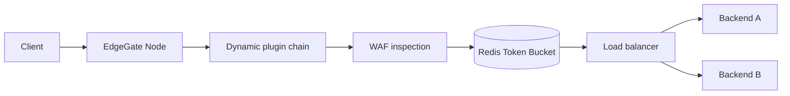

# EdgeGate Node

EdgeGate Node is an API Gateway and reverse proxy built on Node.js 22. It
implements the traffic-management concerns I wanted to study directly instead
of hiding them behind a gateway framework.

## Features

- HTTP/1.1 reverse proxy using Node's native `http` and `https` modules;
- optional HTTP/2 ingress with TLS and HTTP/1.1 fallback;
- round-robin, least-connections and consistent-hash load balancing;
- distributed Token Bucket rate limiting through Redis and an atomic Lua script;
- request WAF for SQL injection, XSS and path traversal signatures;
- request body inspection with a configurable size limit;
- dynamic middleware modules loaded with `import()`;
- configuration and plugin hot reload without process restart;
- request IDs and structured JSON access logs;
- graceful shutdown and health/readiness endpoints;
- Docker Compose demo stack and GitHub Actions CI.

## Architecture



The active route table is compiled before it is swapped into the request path.
If a configuration or plugin update is invalid, the gateway logs the error and
continues serving with the previous route table.

## Run

```bash
cp config.example.json config.json
docker compose up --build
```

Send traffic through the gateway:

```bash
curl -i http://localhost:8080/api/hello
```

The demo has two upstream services. Repeated requests show the selected load
balancing strategy in action.

Test the WAF:

```bash
curl -i 'http://localhost:8080/api/items?q=union%20select%20password%20from%20users'
```

Expected response: `403 Forbidden`.

## Dynamic Plugins

A plugin exports a middleware factory:

```js
export default function plugin(options) {
  return async function middleware(context, next) {
    context.response.setHeader(options.name, options.value);
    await next();
  };
}
```

Register the module in a route:

```json
{
  "module": "./plugins/add-header.js",
  "options": { "name": "x-edgegate", "value": "node-22" }
}
```

Changing the configuration or plugin module rebuilds the middleware chain on
the next configuration reload. The process itself stays online.

## HTTP/2

Plain local development uses HTTP/1.1. Set `TLS_CERT` and `TLS_KEY` to start a
secure HTTP/2 server with `allowHTTP1: true`:

```bash
TLS_CERT=./certs/server.crt TLS_KEY=./certs/server.key npm start
```

## Verification

```bash
npm ci
npm test
npm run check
docker compose config -q
```

The first release focuses on the request path. Active upstream health checks,
circuit breaking, Prometheus metrics and load-test reports are planned next.

## WAF Scope

This WAF is a bounded application-layer filter for the project, not a claim to
replace ModSecurity or a managed WAF. Production work would require rule
versioning, allowlists, false-positive metrics, normalization against encoding
bypasses and a controlled policy distribution process.
