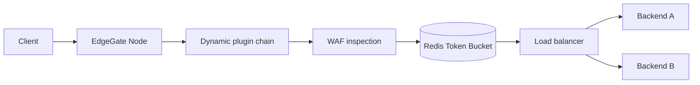

# EdgeGate Node

EdgeGate Node is an API Gateway and reverse proxy built on Node.js 22. It
implements the traffic-management concerns I wanted to study directly instead
of hiding them behind a gateway framework.

## Features

- HTTP/1.1 reverse proxy using Node's native `http` and `https` modules;
- optional HTTP/2 ingress with TLS and HTTP/1.1 fallback;
- round-robin, least-connections and consistent-hash load balancing;
- active upstream health checks with automatic traffic removal;
- circuit breaker with failure thresholds and half-open recovery;
- distributed Token Bucket rate limiting through Redis and an atomic Lua script;
- request WAF for SQL injection, XSS and path traversal signatures;
- request body inspection with a configurable size limit;
- dynamic middleware modules loaded with `import()`;
- route-level API key and JWT HS256 authorization policies;
- configuration and plugin hot reload without process restart;
- request IDs and structured JSON access logs;
- graceful shutdown and health/readiness endpoints;
- Prometheus counters, backend gauges and request latency histograms;
- alert rules for gateway availability, upstream health and p95 latency;
- repeatable Node.js load test with RPS and p50/p95/p99 reporting;
- provisioned Grafana dashboard for traffic, latency and backend state;
- Docker-based e2e failover scenario that stops one upstream during traffic;
- Kubernetes deployment with probes, resources, HPA and PodDisruptionBudget;
- optional cert-manager and nginx-ingress TLS automation;
- automatic GHCR image publishing after CI and e2e checks;
- Docker Compose demo stack and GitHub Actions CI.

## Architecture



The active route table is compiled before it is swapped into the request path.
If a configuration or plugin update is invalid, the gateway logs the error and
continues serving with the previous route table.

Each backend has independent health and circuit state. Active checks remove an
unreachable instance from selection. Passive network and HTTP 5xx failures open
the circuit after the configured threshold; one half-open probe is allowed
after the cooldown period.

## Run

```bash
cp config.example.json config.json
docker compose up --build
```

Send traffic through the gateway:

```bash
curl -i http://localhost:8080/api/hello
```

The demo has two upstream services. Repeated requests show the selected load
balancing strategy in action.

Test the WAF:

```bash
curl -i 'http://localhost:8080/api/items?q=union%20select%20password%20from%20users'
```

Expected response: `403 Forbidden`.

Prometheus metrics are available at `http://localhost:8080/metrics` and the
local Prometheus UI is exposed at `http://localhost:9090`. Grafana is available
at `http://localhost:3000` with the provisioned EdgeGate dashboard
(`admin` / `admin`).

Run a repeatable load sample:

```bash
REQUESTS=5000 CONCURRENCY=50 npm run load
```

The script reports requests per second, response status distribution and
p50/p95/p99 latency. Set `TARGET_URL` to test another route.

Run the full failover check with Docker running:

```bash
npm run e2e
```

The scenario starts the stack, sends a baseline request, stops `backend-a`,
waits for active health checking to remove it and verifies that subsequent
traffic is served only by `backend-b`. The stack is cleaned up afterward.

## Dynamic Plugins

A plugin exports a middleware factory:

```js
export default function plugin(options) {
  return async function middleware(context, next) {
    context.response.setHeader(options.name, options.value);
    await next();
  };
}
```

Register the module in a route:

```json
{
  "module": "./plugins/add-header.js",
  "options": { "name": "x-edgegate", "value": "node-22" }
}
```

Changing the configuration or plugin module rebuilds the middleware chain on
the next configuration reload. The process itself stays online.

Built-in authorization plugins read secrets from environment variables. API
keys are compared with constant-time equality, while JWT verification enforces
the `HS256` algorithm, signature, `exp`, `nbf`, issuer, audience and configured
claims.

Protect a route with API keys:

```json
{
  "name": "api-key",
  "options": { "keysEnv": "EDGEGATE_API_KEYS", "header": "x-api-key" }
}
```

Protect a route with JWT and a required role:

```json
{
  "name": "jwt-hs256",
  "options": {
    "secretEnv": "EDGEGATE_JWT_SECRET",
    "issuer": "identity-service",
    "audience": "edgegate",
    "requiredClaims": { "roles": ["admin"] }
  }
}
```

Secrets are never stored in the route configuration or committed example.

## Kubernetes

The manifests in `deploy/k8s` run two gateway replicas with readiness and
liveness probes, resource limits, horizontal autoscaling and a disruption
budget. The repository also contains a self-contained Redis and demo-upstream
setup for cluster evaluation.

```bash
kubectl apply -f deploy/k8s/edgegate.yaml
```

The optional `deploy/k8s/tls.yaml` uses cert-manager and nginx-ingress to obtain
and renew a Let's Encrypt certificate. Hostname, email and secret values must
be replaced before deployment.

## HTTP/2

Plain local development uses HTTP/1.1. Set `TLS_CERT` and `TLS_KEY` to start a
secure HTTP/2 server with `allowHTTP1: true`:

```bash
TLS_CERT=./certs/server.crt TLS_KEY=./certs/server.key npm start
```

## Verification

```bash
npm ci
npm test
npm run check
docker compose config -q
```

The next layer is distributed configuration delivery and richer WAF policy
management with rule versions and audit events.

## WAF Scope

This WAF is a bounded application-layer filter for the project, not a claim to
replace ModSecurity or a managed WAF. Production work would require rule
versioning, allowlists, false-positive metrics, normalization against encoding
bypasses and a controlled policy distribution process.
