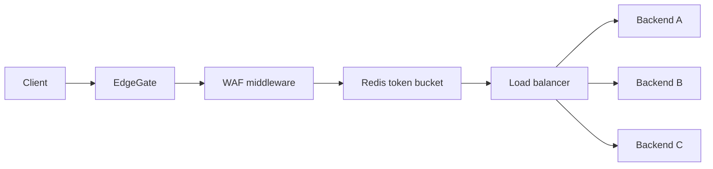

# EdgeGate

EdgeGate is a small API Gateway and reverse proxy written in Go. It is a
focused implementation of the traffic-management layer that usually sits in
front of internal services.

## What It Does

- proxies HTTP requests to configured upstreams;
- supports round-robin, least-connections and consistent-hash balancing;
- applies a Redis-backed token-bucket rate limit per user or client address;
- blocks common SQL injection, XSS and path traversal signatures;
- adds `X-Request-ID` and structured access logs through middleware plugins;
- reloads routing, WAF and plugin configuration without restarting the process;
- exposes separate `/healthz` and `/readyz` endpoints;
- supports HTTP/1.1 directly and HTTP/2 when the server is terminated with TLS.

The implementation uses Go's `net/http` and `httputil.ReverseProxy`. Redis is
used for atomic rate-limit state, so multiple gateway replicas share the same
quota.

## Request Flow



Routes and middleware are described in `config.json`. The process checks the
file every second and atomically swaps the active route table after a valid
change. A malformed update is rejected and the previous configuration keeps
serving traffic.

## Run Locally

```bash
cp config.example.json config.json
docker compose up --build
```

Send a request through the gateway:

```bash
curl -i http://localhost:8080/api/hello
```

The response comes from one of the two demo upstreams. To exercise the WAF:

```bash
curl -i 'http://localhost:8080/api/items?q=%3Cscript%3Ealert(1)%3C%2Fscript%3E'
```

Expected response: `403 Forbidden`.

## Configuration

Each route has a path prefix, an upstream list, a balancing strategy and a
middleware configuration:

```json
{
  "path": "/api",
  "backends": ["http://backend-a:8080", "http://backend-b:8080"],
  "strategy": "least_connections",
  "plugins": ["request-id", "access-log"],
  "rate_limit": {"requests_per_second": 20, "burst": 40},
  "waf": {"enabled": true}
}
```

The plugin registry is intentionally small and explicit. New middleware can
be registered in Go, while enabling or disabling registered plugins is a
configuration change and does not require a restart.

## Verification

```bash
GOCACHE=/tmp/edgegate-go-cache go test ./...
docker compose config -q
```

The tests cover configuration validation, WAF blocking and request middleware.
The next planned layer is active upstream health checking and an end-to-end
load test comparing the balancing strategies.

## Design Notes

The WAF is a deliberately bounded first layer, not a replacement for a mature
managed WAF. It inspects request metadata and up to 1 MiB of body data using
compiled signatures. In production I would add rule versioning, false-positive
metrics, allowlists, body size enforcement and a separate policy distribution
mechanism.
